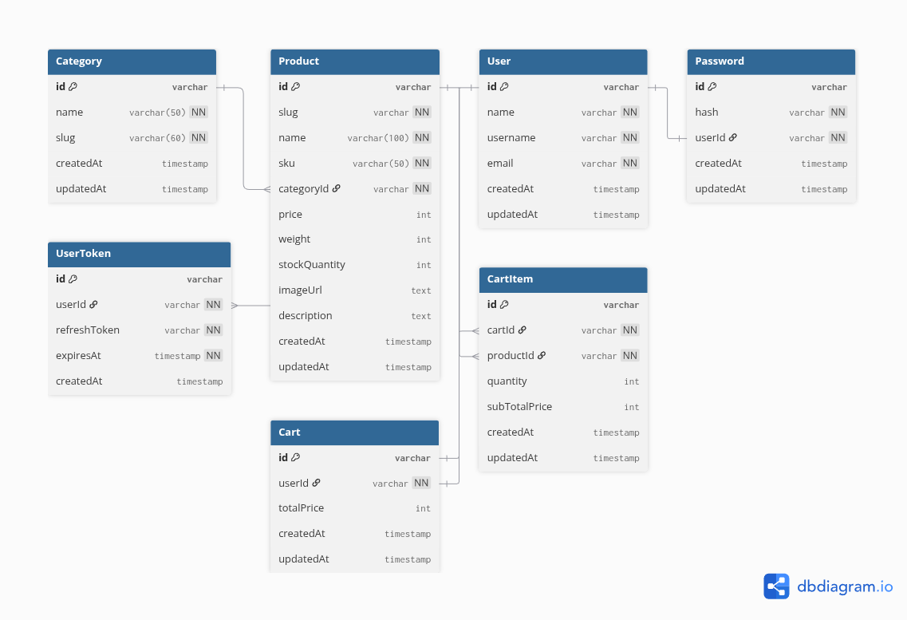

# Beanstack Coffee - Backend API

## ERD



## REST API Specification

- Production: `https://beanstackcoffee-api.radityaabi.com`
- Local: `http://localhost:3000`

Products:

| Endpoint          | HTTP     | Description            |
| ----------------- | -------- | ---------------------- |
| `/products`       | `GET`    | Get all products       |
| `/products/:slug` | `GET`    | Get product by slug    |
| `/products`       | `POST`   | Add new product        |
| `/products/:id`   | `PUT`    | Update product by id   |
| `/products/:id`   | `PATCH`  | Partial update product |
| `/products/:id`   | `DELETE` | Delete product by id   |

Categories:

| Endpoint          | HTTP     | Description           |
| ----------------- | -------- | --------------------- |
| `/categories`     | `GET`    | Get all categories    |
| `/categories`     | `POST`   | Create new category   |
| `/categories/:id` | `DELETE` | Delete category by id |

Users:

| Endpoint           | HTTP  | Permission |
| ------------------ | ----- | ---------- |
| `/users`           | `GET` | Public     |
| `/users/:username` | `GET` | Public     |

Auth:

| Endpoint         | HTTP   | Permission    |
| ---------------- | ------ | ------------- |
| `/auth/register` | `POST` | Public        |
| `/auth/login`    | `POST` | Public        |
| `/auth/me`       | `GET`  | Authenticated |
| `/auth/logout`   | `POST` | Authenticated |

Cart:

| Endpoint          | HTTP     | Permission    |
| ----------------- | -------- | ------------- |
| `/cart`           | `GET`    | Authenticated |
| `/cart/items`     | `POST`   | Authenticated |
| `/cart/items/:id` | `PUT`    | Authenticated |
| `/cart/items/:id` | `DELETE` | Authenticated |

## Getting Started

Copy and edit `.env` file:

```sh
cp .env.example .env
```

Setup database:

```sh
# Run database only
bun docker:up
```

Install dependencies:

```sh
bun install
```

Migrate database and generate Prisma Client:

```sh
bun db:migrate
# prisma migrate dev
```

Seed initial products:

```sh
bun db:seed
# prisma db seed
```

Run development server:

```sh
bun dev
# bun run --hot src/index.ts
```

Open <http://localhost:3000>.

## Production

Make sure the `DATABASE_URL` is configured in `.env` file for usage with Docker Compose.

If we need to build the Docker image:

```sh
bun docker:build
# docker compose up -d --build
```
